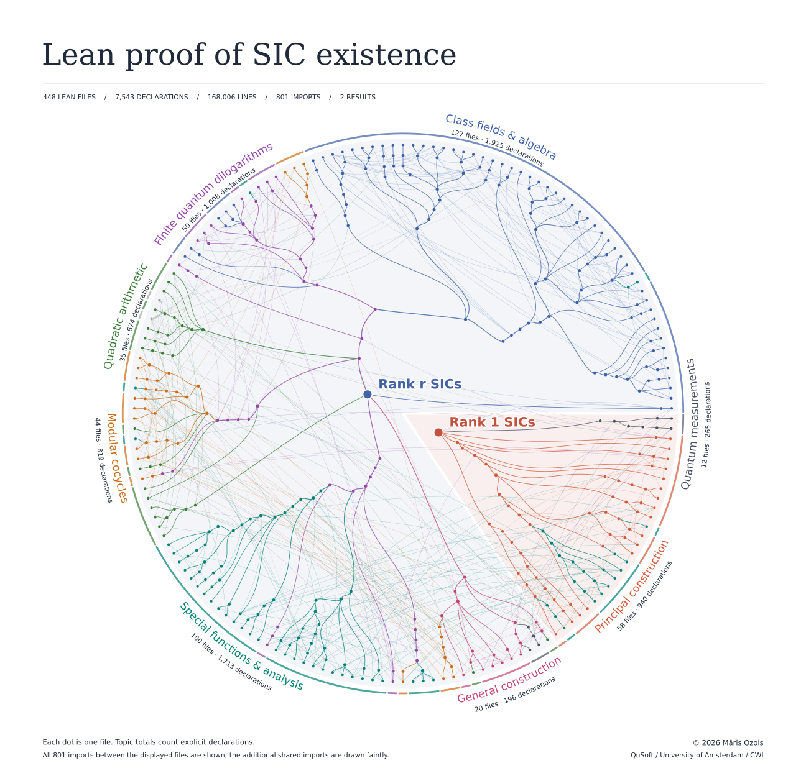

# SIC existence in Lean

A [symmetric informationally complete measurement (SIC)](https://en.wikipedia.org/wiki/SIC-POVM)
is a highly symmetric quantum measurement built from $d^2$ states in dimension $d$, with every
distinct pair having the same overlap.
This is equivalent to $d^2$ equiangular lines in $\mathbb C^d$.
Zauner's conjecture asks whether SICs exist in every finite
dimension.

This project gives an explicit, end-to-end, machine-checked proof in Lean 4 that SICs exist in every finite dimension. It does not claim priority for the existence result or for its essential mathematical ingredients: the conclusion was already known to specialists as a consequence of several recent results (see below). The contribution of this project is to assemble those ingredients and verify the resulting proof formally.

[**MainResults.lean**](MainResults.lean) gives self-contained statements of the two main results,
together with their Lean proofs.

- **Rank one.** For every integer $d \geq 1$, there are $d^2$ distinct rank-one Hermitian
  projectors $P_p$ on $\mathbb C^d$ such that
  $\mathrm{Tr}(P_pP_q)=1/(d+1)$ whenever $p\ne q$.

  ```lean
  theorem exists_SIC (d : ℕ) (hd : d ≥ 1) :
      ∃ P : Fin d × Fin d → Matrix (Fin d) (Fin d) ℂ,
        (∀ p, (P p).conjTranspose = P p ∧ (P p) ^ 2 = P p ∧ (P p).rank = 1) ∧
        (∀ p q, p ≠ q → (P p * P q).trace = 1 / ((d : ℂ) + 1)) := by
  ```

- **Rank $r$.** For integers $r\geq1$ and $d\geq2r+2$ satisfying
  $nr(d-r)=d^2-1$ for some integer $n\geq5$, there are $d^2$ distinct rank-$r$ Hermitian
  projectors $P_p$ on $\mathbb C^d$ such that
  $\mathrm{Tr}(P_pP_q)=r(rd-1)/(d^2-1)$ whenever $p\ne q$.

  ```lean
  theorem exists_RSIC (d r : ℕ) (hr : r ≥ 1) (hd : d ≥ 2 * r + 2)
      (hn : ∃ n : ℕ, n ≥ 5 ∧ n * r * (d - r) = d ^ 2 - 1) :
      ∃ P : Fin d × Fin d → Matrix (Fin d) (Fin d) ℂ,
        (∀ p, (P p).conjTranspose = P p ∧ (P p) ^ 2 = P p ∧ (P p).rank = r) ∧
        (∀ p q, p ≠ q → (P p * P q).trace =
          (r : ℂ) * ((r : ℂ) * (d : ℂ) - 1) / ((d : ℂ) ^ 2 - 1)) := by
  ```

Both results are *unconditional*, meaning that they do not depend on any open conjectures.
The rank-one result has a separate, simpler proof parallel to the general case, rather than just setting $r=1$.
The statements use only standard concepts from
[Mathlib](https://github.com/leanprover-community/mathlib4).
Both results produce SICs that consist of an orbit of a fiducial state under the Weyl–Heisenberg group.

## Building and checking

Install [Lean](https://lean-lang.org/install/) and then from the repository root:

```sh
lake exe cache get   # download prebuilt Mathlib
lake build           # check every proof in the project
```

The build also prints the axioms both main results depend on: only the standard `propext`,
`Classical.choice`, and `Quot.sound`, without `sorryAx`.

## Size and structure

The formalization is about 168,000 lines of Lean in 449 files, all of which are reached by
the import closure of `MainResults.lean`. These contain roughly 7,500 declarations: about 6,400
theorems and lemmas, 1,000 definitions, and a hundred structures and instances. The line count
includes comments and blank lines; Mathlib is not counted.

[](proof-map.png)

Each dot represents a Lean file in the import closure of `MainResults.lean`, with the
rank-one and rank-$r$ branches on separate sides and files colored by mathematical topic.
Following a branch inward leads to the file that imports it. Faint lines show additional
shared imports.

## Sources

The SIC existence argument draws chiefly on five recent sources:

- **[AFK25, Appleby, Flammia, Kopp (2025)]**. *A constructive approach to
  Zauner's conjecture via the Stark conjectures*.
  [arXiv:2501.03970v2](https://arxiv.org/abs/2501.03970v2).
  Proves Zauner's conjecture conditionally on the Twisted Convolution Conjecture (TCC) and the
  rank-one abelian Stark conjecture for real quadratic fields.

- **[72, Kopp (2024)]**. *The Shintani–Faddeev modular cocycle: Stark units
  from $q$-Pochhammer ratios*.
  [arXiv:2411.06763v3](https://arxiv.org/abs/2411.06763v3).
  Provides the analytic link between AFK25's SIC construction and the Stark conjectures.

- **[RW26, Radchenko, Wheeler (2026)]**. *Real quadratic fields and finite
  quantum dilogarithms I*.
  [arXiv:2609.21892v2](https://arxiv.org/abs/2609.21892v2).
  Proves the rank-one twisted convolution identity required by AFK25 and the algebraicity of
  real-quadratic Stark invariants.

- **[AFK26, Appleby, Flammia, Kopp (2026)]**. *The twisted convolution
  identity and ghost $r$-SICs from finite quantum dilogarithms*.
  [arXiv:2609.39192v1](https://arxiv.org/abs/2609.39192v1).
  Extends the twisted convolution identity to all admissible ranks and constructs the ghost
  $r$-SICs used in the general-rank existence proof.

- **[RW26b, Radchenko, Wheeler (2026b)]**. *Stark units for real quadratic
  fields and reciprocity laws*.
  [Manuscript (4 October 2026)](https://www.danrad.net/papers/stark-reciprocity.pdf).
  Proves the Stark unit and reciprocity results that complete the SIC existence proof and resolve
  [Hilbert's twelfth problem](https://en.wikipedia.org/wiki/Hilbert%27s_twelfth_problem)
  for real quadratic fields.
  Following a communication from Imran Zaidi about an LLM-assisted proof, the authors used an LLM to generate their own proof based on RW26 and initial ideas about reciprocity. They then checked the arguments and edited the exposition.

Substantial additional mathematical background also had to be formalized, particularly in (ray)
class field theory, drawing on standard references by Milne, Childress, and Neukirch, as well as
Shintani (1977) for the Barnes double-gamma construction and double-sine product formula.
The full version-pinned bibliography is in [**REFERENCES.md**](REFERENCES.md).

## Author

This formalization is authored by [Māris Ozols](https://homepages.cwi.nl/~maris/) from
[QuSoft](https://qusoft.org/) / [University of Amsterdam](https://www.uva.nl/en) /
[CWI](https://www.cwi.nl/en/). It is released under the [Apache License 2.0](LICENSE).

## Models used

Orchestration was mostly done by Claude Fable 5 and 5.1.
Claude Opus 5 and 5.5, Claude Sonnet 5 and 5.5, and GPT-6 Astra supported orchestration and research.
GPT-5.6 Sol and GPT-6 Sol handled most delegated Lean proofs.

## Acknowledgements

I thank [Steve Flammia](https://sflammia.github.io/) for helpful conversations. This work was
supported by OpenAI through complimentary access to ChatGPT under the ChatGPT for Academic
Researchers program and by Anthropic through academic access to Claude Code.
